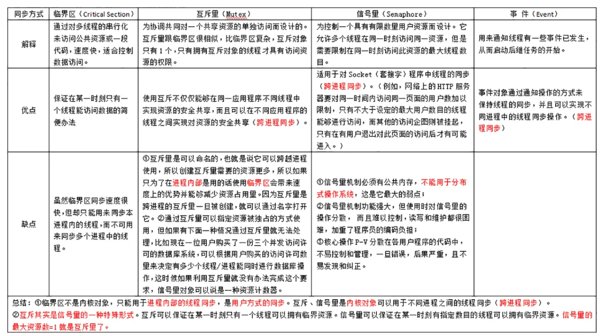

线程间同步的方法
1.临界区：只能用于线程内部的线程同步2.互斥量（mutex):只有拥有互斥对象的线程才有资格访问资源3.信号量：可以允许多个线程在同一时刻访问资源，但有数目限制4.事件（event):用来通知线程某些事件已经发生，可以启动后3种都是跨进程同步

进程间同步方法
进程间为什么要同步？保证对临界区的互斥访问，主要有信号量和管程
线程间通信的方法
1.锁机制：互斥锁，读写锁，条件变量2.信号量机制：3.信号机制：
进程间通信方法（IPC）
1.无名管道（pipe）及命名管道（named pipe）：管道可用于具有亲缘关系的父子进程间的通信，有名管道除了具有管道所具有的功能外，它还允许无亲缘关系进程间的通信；2.消息队列：具有写权限得进程可以按照一定得规则向消息队列中添加新信息； 对消息队列有读权限得进程则可以从消息队列中读取信息；3.共享内存：它使得多个进程可以访问同一块内存空间，不同进程可以及时看到对方进程中对共享内存中数据得更新。4.信号：信号是一种比较复杂的通信方式，用于通知接收进程某个事件已经发生；5.socket：这是一种更为一般得进程间通信机制，它可用于网络中不同机器之间的进程间通信，应用非常广泛6.信号量:信号量是一个计数器，可以控制多个进程对共享资源的访问

CPU 的三级缓存结构
在 CPU Cache 的概念刚出现时，CPU 和内存之间只有一个缓存，随着芯片集成密度的提高，现代的 CPU Cache 已经普遍采用 L1/L2/L3 多级缓存的结构来改善性能。自顶向下容量逐渐增大，访问速度也逐渐降低。当缓存未命中时，缓存系统会向更底层的层次搜索。
● L1 Cache： 在 CPU 核心内部，分为指令缓存和数据缓存，分开存放 CPU 使用的指令和数据；
● L2 Cache： 在 CPU 核心内部，尺寸比 L1 更大；
● L3 Cache： 在 CPU 核心外部，所有 CPU 核心共享同一个 L3 缓存。
共享内存实现原理
共享内存字段依靠在栈之下，最大限制为32M；共享的物理地址

进程间通信的方式只采用sockets
1.可以跨主机2.相比pipe需要两个文件描述符，而且要在父子进程间通信
信号和信号量的区别
信号可以在任何时候发送给某一进程而无需知道该进程的状态，signal函数用于设置信号的处理
操作系统的线程与进程的区别，线程的几种状态。协程？
进程是操作系统进行资源分配和调度一个基本单位进程在执行过程中拥有独立的内存单元，而多个线程共享进程的内存
1.进程是内存中运行的程序，线程就是操作系统进行运算调度的最小单位
2.线程的特点是共享地址空间，从而高效的共享数据；线程可以共享代码段，但不能共享数据，基本上不拥有资源，上下文切换很快，资源开销少协程：协程是一种用户态的轻量级线程，协程的调度完全由用户控制。拥有自己的寄存器上下文和栈，上下文切换的非常快区别：一个线程可以拥有多个协程，一个进程也可以拥有多个协程，线程和进程都是同步机制，而协程则是异步机制，
c++中的协程
一个线程可以包含多个协程，但某个时刻只能有一个协程在运行，多个协程分享该线程分配到的计算机资源（协程允许我们用同步代码的逻辑，做着异步的事）协程的上下文包含属于他的栈区和寄存器里面存放的值主要是异步操作的优势：异步操作为了避免IO操作阻塞线程1.保存当前协程的上下文(运行栈，返回地址，寄存器状态)2.设置将要唤醒的协程的入口指令地址到IP寄存器3.恢复将要切换的协程的上下文
进程fork之后发生了什么
● 由fork创建的新进程被称为子进程（child process）。该函数被调用一次，但返回两次。两次返回的区别是子进程的返回值是0，而父进程的返回值则是新进程（子进程）的进程 id。将子进程id返回给父进程的理由是：因为一个进程的子进程可以多于一个，没有一个函数使一个进程可以获得其所有子进程的进程id。对子进程来说，之所以fork返回0给它，是因为它随时可以调用getpid()来获取自己的pid；也可以调用getppid()来获取父进程的id。(进程id 0总是由交换进程使用，所以一个子进程的进程id不可能为0 )。fork之后，操作系统会复制一个与父进程完全相同的子进程，虽说是父子关系，但是在操作系统看来，他们更像兄弟关系，这2个进程共享代码空间，但是数据空间是互相独立的，子进程数据空间中的内容是父进程的完整拷贝，指令指针也完全相同，子进程拥有父进程当前运行到的位置（两进程的程序计数器pc值相同，也就是说，子进程是从fork返回处开始执行的），但有一点不同，如果fork成功，子进程中fork的返回值是0，父进程中fork的返回值是子进程的进程号，如果fork不成功，父进程会返回错误。可以这样想象，2个进程一直同时运行，而且步调一致，在fork之后，他们分别作不同的工作，也就是分岔了。这也是fork为什么叫fork的原因至于那一个最先运行，可能与操作系统（调度算法）有关，而且这个问题在实际应用中并不重要，如果需要父子进程协同，可以通过原语的办法解决
fork,vfork,clone 的区别
[https://blog.csdn.net/gogokongyin/article/details/51178257?utm_medium=distribute.pc_relevant_t0.none-task-blog-BlogCommendFromMachineLearnPai2-1.channel_param&depth_1-utm_source=distribute.pc_relevant_t0.none-task-blog-BlogCommendFromMachineLearnPai2-1.channel_param]fork之后,子进程和父进程共享代码段，共享物理地址空间，共享同一个偏移量;但是父子进程各自有自己的虚拟地址空间，页表，栈，所以他们指向相同的物理地址，同时将共享的页面标记为只读，当有进程发生写时，采取写时复制机制，1.fork会复制页表 ，vfork不会2.vfrok之后子进程会先退出3.clon不会复制栈空间，而是自己会先创建一个新的
进程调度算法
1.先来先服务调度算法
2.短作业优先调度算法
3.时间片轮转算法
长连接短连接的区别
短连接：每次通信时，创建socket，通信结束后调用socket长连接：每次通信完毕后，不会关闭连接
死锁的检测方法
1.使用netstat -tpna |grep ：port就能立刻列出用到某服务的客户端地址。然后用netstat或者lsof命令可以找出那个进程发起的连接
2.通过netstat -tn 打印RECV-Q和send-Q正常应该接近0，如果在持续增加可能是因为死锁
什么是死锁？ 死锁产生的条件？
1.死锁的概念：在两个或者多个并发程序中，如果每个进程持有资源又等待其他进程释放它后者他们现在保持的资源，在未改变这种状态前都不能向前推进，称这一组线程产生了死锁2.死锁产生的四个必要条件：互斥：至少有一个资源必须属于非共享模式，即一次只能被一个进程使用；若其他申请使用该资源，那么申请进程必须等到该资源被释放为止；占有占有并等待：一个进程必须至少占有一个资源，并等待另一个资源，而该资源为其他进程所占有非抢占：进程不能被抢占循环等待：若干进程之间形成一种头尾相接的环形等待资源
3.死锁处理的基本策略和常用方法死锁预防：只要保证打破四个条件中的一个就可以死锁避免：就是动态的检测资源分配状态，以确保循环等待条件不成立死锁解除：进程终止和资源抢占。
进程有哪几种状态？
就绪状态：进程已经获取除处理机以外 的所需资源，等待分配处理机资源运行状态：占用处理机资源运行，处于状态机的进程数小于等于CPU数阻塞状态：进程等待某种条件，条件完成之前无法满足
线程有几种状态
1.创建（new)2.就绪（runnable/start)3.运行（running）4.阻塞（blocked)5.等待（waiting）6.时间等待（time waiting)7.消亡（dead/terminated)
分页和分段有什么区别（内存管理）？
分段：符合用户视角的内存分配管理方案，将程序的地址空间划分为若干段， 分页：将程序的逻辑地址划分为固定大小的页，而物理内存划分为同样大小的帧，可以将任意的页放入任意一个帧中两者的不同点：目的不同：分页是由于系统管理的需要而不是用户的需要，它是信息的物理单位；分段的目的是为了能更好地满足用户的需要，它是信息的逻辑单位，它含有一组其意义相对完整的信息；大小不同：页的大小固定且由系统决定，而段的长度却不固定，由其所完成的功能决定；地址空间不同： 段向用户提供二维地址空间；页向用户提供的是一维地址空间信息共享：段是信息的逻辑单位，便于存储保护和信息的共享，页的保护和共享受到限制；内存碎片：页式存储管理的优点是没有外碎片（因为页的大小固定），但会产生内碎片（一个页可能填充不满）；而段式管理的优点是没有内碎片（因为段大小可变，改变段大小来消除内碎片）。但段换入换出时，会产生外碎片（比如4k的段换5k的段，会产生1k的外碎片）。
缺页中断：
访问的页不在主存，需要操作系统将其调入主存后访问
操作系统中进程调度策略有哪些？
1.FCFS(先来先服务，队列实现，非抢占的)：先请求CPU的进程先分配到CPU2.优先级调度算法(可以是抢占的，也可以是非抢占的)：优先级越高越先分配到CPU，相同优先级先到先服务，存在的主要问题是：低优先级进程无穷等待CPU，会导致无穷阻塞或饥饿；解决方案：老化3.时间片轮转调度算法(可抢占的)：队列中没有进程被分配超过一个时间片的CPU时间，除非它是唯一可运行的进程。如果进程的CPU区间超过了一个时间片，那么该进程就被抢占并放回就绪队列。
操作系统的僵死进程和孤儿进程的区别。
僵死进程：是指完成执行，但在操作系统的进程表中仍有一个表项（进程控制PCB),处于终止状态的进程 父进程没有调用wait就退出了，
孤儿进程：父进程执行完被终止，子进程仍然继续运行的进程守护进程：在后台执行的程序
磁盘的寻道算法
1.先来先服务算法（FCFS），
2.最短寻道时间优先算法（SSTF）
3.扫描算法（SCAN），
4.循环扫描算法（CSCAN）
线程模型
内核级线程模型：用户级线程模型：混合式线程模型：
单核CPU中的线程会有线程安全问题吗
会
前台进程和后台进程的区别
后台程序基本上不和用户交互，优先级别稍微低一点前台的程序和用户交互，需要较高的响应速度，优先级别稍微高一点

线程一般拥有什么资源
线程ID，寄存器的值，栈，信号屏蔽字
进程一般拥有什么资源
标识线程的线程Id ,一组寄存器值，栈，调度优先级和策略，信号屏蔽字，页表，task结构
同一进程下的线程共享什么信息
线程私有：栈和程序计数器共享： 堆，地址空间，文件描述符（可执行程序的代码，程序的全局内存和堆内存，栈，以及文件描述符）
父进程fork子进程你两者共享什么？
子进程获得父进程的数据空间，堆和栈的副本，但并不共享这些存储空间他们共享代码文本段，同一个文件偏移量
函数调用和系统调用的区别
系统调用：存在堆栈的切换函数调用：开销较小

协程
最大的优势就是协程极高的执行效率。因为子程序切换不是线程切换，而是由程序自身控制，因此，没有线程切换的开销，和多线程比，线程数量越多，协程的性能优势就越明显。第二大优势就是不需要多线程的锁机制，因为只有一个线程，也不存在同时写变量冲突，在协程中控制共享资源不加锁，只需要判断状态就好了，所以执行效率比多线程高很多。
虚拟内存
● 虚拟内存是计算机系统内存管理的一种技术，他使得应用程序认为它拥有连续的可用内存，而实际上，它通常被分成多个物理内存碎片；
● 一个系统内的进程之间共享cpu和主存资源的，越来越多的进程会导致主存用尽，而且多个进程可能会占据同一块主存导致错误，所以虚拟内存就是对每个进程都提供一个单独的私有的地址空间， 提高了安全性
● MMU:CPU芯片上的内存管理单元，利用存放在主存上的页表来动态的翻译虚拟地址空间
● 操作系统引入虚拟内存，进程持有的虚拟地址会通过cpu芯片中的内存管理单元(MMU)的映射关系，来转变为物理地址，然后通过物理地址访问内存
● 虚拟地址和物理地址的管理方式：分段，分页点这里[https://zhuanlan.zhihu.com/p/153250917]
内存管理
虚拟寻址:cpu通过使用虚拟地址经过mmu转换成物理地址(虚拟地址在磁盘上,物理地址在内存)，当我们想要访问一个虚拟地址，发现它没有页命中(即没有对应的物理地址)，此时发生缺页中断，内核将会根据页面置换算法将其中一个放在物理地址的页放回到磁盘，修改对应的页表，表示他在磁盘上，然后将需要访问的虚拟内存复制到物理内存 ，
页面置换算法
1.FIFO2.LRU3.LFU
进程和线程、上下文切换了什么、共享了什么
进程上下文切换：
1.切换页表全局目录
2.切换内核态堆栈
3.切换硬件上下文
4.刷新TLB(地址转换后援缓冲器)、
5.系统调度器的代码执行

BUFFER缓冲和cache缓存的区别
1.buffer(缓冲)是为了提高内存和硬盘（或其他I/O设备）之间的数据交换的速度而设计的
2.cache(缓存)是为了提高cpu和内存之间的数据交换速度而设计

linux下怎么清理系统缓存并释放内存
free -h 看内存是否已经释放掉了
1.sync(我们在清理缓存先要先把buffe中的数据先写入到硬盘中)
2.echo
3 > /proc/sys/vm/drop_caches (3：释放所有缓存)
动态链接和静态链接发生了什么
linux下编译流程预编译(.i)->编译(.s)->汇编(.o)->链接(可执行文件)静态链接:在链接的时候直接将.o文件打包动态编译:运行的时候才生成，所以节约空间，预编译: gcc -E hello.c -o hello.i编译： gcc -S hello.i -o hello.s汇编：gcc -c hello.s -o hello.o连接： gcc -o hello

linux是如何避免内存碎片的
1.伙伴算法，用于管理物理碎片，避免内存碎片2.高速缓存Slab层用于管理内核分配内存，避免碎片
页缓存和块缓存
linux操作系统为了减少对磁盘的Io操作，会将打开的磁盘内容进行缓存，而缓存的地方则是物理内存，进而将对磁盘的访问转换成对内存的访问，有效提高程序的速度。linux的缓存方式是利用物理内存缓存磁盘上的内容，成为页缓存
缓存IO和直接IO
写操作：数据先从用户态拷贝到内核态中的页缓存中，然后又会从页缓存中写入到磁盘中直接IO:跳过内核缓冲区，数据直接从用户态地址空间写入到磁盘中

IO多路复用中的select和epoll的区别？
● IO 多路复用是一种同步IO模型，实现一个线程可以监视多个文件句柄；
● 一旦某个文件句柄就绪，就能够通知应用程序进行相应的读写操作；
● 没有文件句柄就绪就会阻塞应用程序，交出CPU

从epoll的原理角度出发，epoll主要有epoll_create,epoll_ctl,epoll_wait三个系统调用，epoll采用基于事件的就绪方式，，poll需要调用一定的方法后，内核才会对监视的文件描述符进行扫描，而epoll则是事先注册好，直接触发回调，
1.支持一个进程打开大数目的socket描述符(FD)
2.IO效率不随FD数目增加而线性下降
3.使用mmap加速内核与用户空间的消息传递
select:
单个进程可监视的fd数量被限制，即能监听端口的大小有限。
对socket进行扫描时是线性扫描，即采用轮询的方法，效率较低：
需要维护一个用来存放大量fd的数据结构，这样会使得用户空间和内核空间在传递该结构时复制开销大
poll本质上和select没有区别，它将用户传入的数组拷贝到内核空间，然后查询每个fd对应的设备状态，如果设备就绪则在设备等待队列中加入一项并继续遍历，如果遍历完所有fd后没有发现就绪设备，则挂起当前进程，直到设备就绪或者主动超时，被唤醒后它又要再次遍历fd。这个过程经历了多次无谓的遍历。

poll本质上和select没有区别，但是它没有最大连接数的限制，原因是它是基于链表来存储的

系统
死锁必要条件是什么？
如果在一个系统中以下四个条件同时成立，那么就能引起死锁：
1. 互斥：至少有一个资源必须处于非共享模式，即一次只有一个进程可使用。如果另一进程申请该资源，那么申请进程应等到该资源释放为止。
2. 占有并等待：—个进程应占有至少一个资源，并等待另一个资源，而该资源为其他进程所占有。
3. 非抢占：资源不能被抢占，即资源只能被进程在完成任务后自愿释放。
4. 循环等待：有一组等待进程 {P0，P1，…，Pn}，P0 等待的资源为 P1 占有，P1 等待的资源为 P2 占有，……，Pn-1 等待的资源为 Pn 占有，Pn 等待的资源为 P0 占有。
   Linux 指令
   ● 查看CPU信息 cat /proc/cpuinfo
   ● 查看磁盘的使用情况 df
   ● 查看网络端口情况 netstat -n 或者 lsof -i -P -n | grep LISTEN
   ● 查看 CPU的使用/当前进程/内存的使用 情况 top
   ● 查看系统整体内存情况 free 或者 cat /proc/meminfo
   ● 网络抓包tcpdump
   ● 查看进程的进程ID ps 如果是Java程序可以用Java命令 jps

进程通讯有哪些方式？
● 管道
● 消息队列
● 共享内存
● 信号/信号量
● Socket套接字 (项目中最常用使用的方式)
管道
管道是进程之间进行单向通信的一种机制，在Linux操作系统里面，经常会使用到管道命令，比如：使用管道符 | 和 grep 命令对输出的信息进行过滤：
ps -aux | grep java
上面这种管道是没有名字，所以 | 表示为匿名管道，用完了就销毁。有另外一个类型是命名管道，也被叫做 FIFO，可以通过 mkfifo 来创建命名管道。匿名管道与命名管道之间的区别与联系：
● 和管道一样，命名管道也只支持单向的数据流；
● 对于匿名管道，它的通信范围只存在父子进程中。因为匿名管道只存在于内存中，没有实体，也就是没有管道文件，只能通过 fork() 来复制父进程 fd (文件描述符)，来达到通信的目的。
● 对于命名管道，它可以在不相关的进程间也能相互通信。因为命令管道是一个设备文件，在进程里只要使用这个设备文件，就可以相互通信。

消息队列
消息队列是消息的链表,具有特定的格式,存放在内存中并由消息队列标识符标识。管道和消息队列的通信数据都是先进先出的原则。与管道（⽆名管道：只存在于内存中的⽂件；命名管道：存在于实际的磁盘介质或者⽂件系统）不同的是消息队列存放在内核中，只有在内核重启(即，操作系统重启)或者显示地删除⼀个消息队列时，该消息队列才会被真正的删除。消息队列可以实现消息的随机查询,消息不⼀定要以先进先出的次序读取,也可以按消息的类型读取.⽐ FIFO 更有优势。消息队列克服了信号承载信息量少，管道只能承载⽆格式字节流以及缓冲区⼤⼩受限等缺。

进程的调度算法有哪些?
● 先到先服务(FCFS)调度算法 : 从就绪队列中选择⼀个最先进⼊该队列的进程为之分配资源，使它⽴即执⾏并⼀直执⾏到完成或发⽣某事件⽽被阻塞放弃占⽤ CPU 时再重新调度。
● 短作业优先(SJF)的调度算法 : 从就绪队列中选出⼀个估计运⾏时间最短的进程为之分配资源，使它⽴即执⾏并⼀直执⾏到完成或发⽣某事件⽽被阻塞放弃占⽤ CPU 时再重新调度。
● 时间⽚轮转调度算法 : 时间⽚轮转调度是⼀种最古⽼，最简单，最公平且使⽤最⼴的算法，⼜称 RR(Round robin)调度。每个进程被分配⼀个时间段，称作它的时间⽚，即该进程允许运⾏的时间。
● 多级反馈队列调度算法 ：前⾯介绍的⼏种进程调度的算法都有⼀定的局限性。如短进程优先的调度算法，仅照顾了短进程⽽忽略了⻓进程 。多级反馈队列调度算法既能使⾼优先级的作业得到响应⼜能使短作业（进程）迅速完成。因⽽它是⽬前被公认的⼀种较好的进程调度算法，UNIX 操作系统采取的便是这种调度算法。
● 优先级调度 ： 为每个流程分配优先级，⾸先执⾏具有最⾼优先级的进程，依此类推。具有相同优先级的进程以 FCFS ⽅式执⾏。可以根据内存要求，时间要求或任何其他资源要求来确定优先级。

内存管理机制了解吗？
操作系统的内存管理主要负责内存的分配与回收（malloc 函数：申请内存，free 函数：释放内存），另外地址转换也就是将逻辑地址转换成相应的物理地址等功能也是操作系统内存管理做的事情
简单分为连续分配管理⽅式和⾮连续分配管理⽅式这两种。连续分配管理⽅式是指为⼀个⽤户程序分配⼀个连续的内存空间，常⻅的如块式管理 。同样地，⾮连续分配管理⽅式允许⼀个程序使⽤的内存分布在离散或者说不相邻的内存中，常⻅的如⻚式管理 和 段式管理。
● 块式管理 ： 远古时代的计算机操系统的内存管理⽅式。将内存分为⼏个固定⼤⼩的块，每块
中只包含⼀个进程。如果程序运⾏需要内存的话，操作系统就分配给它⼀块，如果程序运⾏只需要很⼩的空间的话，分配的这块内存很⼤⼀部分⼏乎被浪费了。这些在每个块中未被利⽤的空间，我们称之为碎⽚。
● ⻚式管理 ：把主存分为⼤⼩相等且固定的⼀⻚⼀⻚的形式，⻚⼩，相对相⽐于块式管理的划分⼒度更⼤，提⾼了内存利⽤率，减少了碎⽚。⻚式管理通过⻚表对应逻辑地址和物理地址
● 段式管理 ： ⻚式管理虽然提⾼了内存利⽤率，但是⻚式管理其中的⻚实际并⽆任何实际意义。段式管理把主存分为⼀段段的，每⼀段的空间⼜要⽐⼀⻚的空间⼩很多 。但是，最重要的是段是有实际意义的，每个段定义了⼀组逻辑信息，例如,有主程序段 MAIN、⼦程序段 X、数据段 D及栈段 S 等。 段式管理通过段表对应逻辑地址和物理地址。
● 段⻚式管理：段⻚式管理机制结合了段式管理和⻚式管理的优点。简单来说段⻚式管理机制就是把主存先分成若⼲段，每个段⼜分成若⼲⻚，也就是说 段⻚式管理机制 中段与段之间以及段的内部的都是离散的。
内存页大小对系统的影响？
● 过小的页面大小会带来较大的页表项增加寻址时TLB的查找速度和额外开销，但是也会减少程序中的内存碎片，提高内存的利用率 (每个进程占用较多的页面，从而导致进程的页表过长，占用大量内存，还会降低页面换进换出的效率)
● 过大的页面大小会浪费内存空间，造成内存碎片，降低内存的利用率，但是可以较少进程中的页表项以及TLB的寻址时间;

分⻚机制和分段机制有哪些共同点和区别呢？
共同点 ：
● 分⻚机制和分段机制都是为了提⾼内存利⽤率，较少内存碎⽚；
● ⻚和段都是离散存储的，所以两者都是离散分配内存的⽅式。但是，每个⻚和段中的内存是连续的；
区别：
● ⻚的⼤⼩是固定的，由操作系统决定；⽽段的⼤⼩不固定，取决于我们当前运⾏的程序。
● 分⻚仅仅是为了满⾜操作系统内存管理的需求，⽽段是逻辑信息的单位，在程序中可以体现为代码段，数据段，能够更好满⾜⽤户的需要。
快表和多级⻚表了解吗？
分⻚内存管理中，很重要的两点是：
● 虚拟地址到物理地址的转换要快。
● 解决虚拟地址空间⼤，⻚表也会很⼤的问题
为了解决虚拟地址到物理地址的转换速度，操作系统在 ⻚表⽅案 基础之上引⼊了 快表 来加速虚拟地址到物理地址的转换。我们可以把块表理解为⼀种特殊的⾼速缓冲存储器（Cache），其中的内容是⻚表的⼀部分或者全部内容。作为⻚表的 Cache，它的作⽤与⻚表相似，但是提⾼了访问速率。由于采⽤表做地址转换，读写内存数据时 CPU 要访问两次主存。有了快表，有时只要访问⼀次⾼速缓冲存储器，⼀次主存，这样可加速查找并提⾼指令执⾏速度。
引⼊多级⻚表的主要⽬的是为了避免把全部⻚表⼀直放在内存中占⽤过多空间，特别是那些根本就不需要的⻚表就不需要保留在内存中。
总结：为了提⾼内存的空间性能，提出了多级⻚表的概念；但是提到空间性能是以浪费时间性能为基础的，因此为了补充损失的时间性能，提出了快表（即 TLB）的概念。
逻辑地址和物理地址？
我们编程⼀般只有可能和逻辑地址打交道，⽐如在 C 语⾔中，指针⾥⾯存储的数值就可以理解成为内存⾥的⼀个地址，这个地址也就是我们说的逻辑地址，逻辑地址由操作系统决定。物理地址指的是真实物理内存中地址，更具体⼀点来说就是内存地址寄存器中的地址。物理地址是内存单元真正的地址。
什么是虚拟内存？
一种内存管理技术。它使得应用程序认为它拥有连续可用的内存空间。⽽实际上，它通常是被分隔成多个物理内存碎⽚，还有部分暂时存储在外部磁盘存储器上，在需要时进⾏数据交换。
内存分配中的外部碎片和内部碎片
● 内部碎片：就是已被分配出去的，却无法回收利用的内存空间。是处于OS为进程分配的内存的区域内部的存储块。占有这些区域的进程并不使用这个存储块。而在进程占有这块存储块时，系统无法利用它。直到进程释放它，或进程结束时，系统才有可能利用这个存储块。
● 外部碎片：外部碎片指的是还没有被分配出去，由于太小无法分配给申请内存空间的新进程的内存空闲区域。是处于任何两个已分配区域之间的空闲存储块。这些存储块的总和可以满足当前申请的长度要求，但是由于它们的地址不连续或其他原因，使得系统无法满足当前申请。

CPU 寻址了解吗?为什么需要虚拟地址空间?
现代处理器使⽤的是⼀种称为 虚拟寻址(Virtual Addressing) 的寻址⽅式。使⽤虚拟寻址，CPU 需要将虚拟地址翻译成物理地址，这样才能访问到真实的物理内存。 实际上完成虚拟地址转换为物理地址转换的硬件是 CPU 中含有⼀个被称为 内存管理单元（Memory Management Unit, MMU） 的硬件。
为什么要有虚拟地址空间呢？没有虚拟地址空间的时候，程序是直接访问和操作的都是物理内存。如果直接把物理地址暴露出来的话会带来严重问题，⽐如可能对操作系统造成伤害以及给同时运⾏多个程序造成困难。通过虚拟地址访问内存有以下优势：
● 程序可以使⽤⼀系列相邻的虚拟地址来访问物理内存中不相邻的⼤内存缓冲区。
● 程序可以使⽤⼀系列虚拟地址来访问⼤于可⽤物理内存的内存缓冲区。当物理内存的供应量变⼩时，内存管理器会将物理内存⻚（通常⼤⼩为 4 KB）保存到磁盘⽂件。数据或代码⻚会根据需要在物理内存与磁盘之间移动。
● 不同进程使⽤的虚拟地址彼此隔离。⼀个进程中的代码⽆法更改正在由另⼀进程或操作系统使⽤的物理内存。